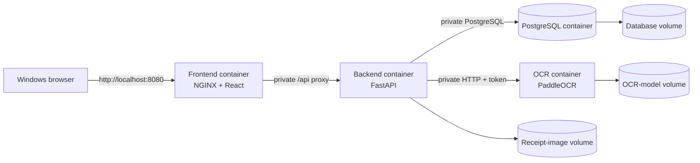

# Local Windows Docker architecture

The entire application runs in Docker Desktop on one Windows computer.

## Container ownership

| Container | Responsibility | Host exposure |
| --- | --- | --- |
| `frontend` | Serves the React build and proxies `/api` to FastAPI | `127.0.0.1:8080` by default |
| `backend` | Inventory rules, database transactions, receipt workflow, OCR orchestration | None |
| `ocr-gateway` | PaddleOCR inference | None |
| `database` | PostgreSQL 18 | None |

Only the frontend publishes a Windows host port. Database credentials and the OCR token stay inside the Docker network. The browser uses same-origin `/api` requests, so it never needs a backend hostname or database credentials.

## Persistent data on the Windows device

Compose creates three named Docker volumes:

- `sari-database-data` — PostgreSQL tables and indexes.
- `sari-receipt-images` — original uploaded receipt images.
- `sari-ocr-models` — downloaded PaddleOCR model files.

`docker compose down` preserves these volumes. Do not use `docker compose down --volumes` unless the intention is to permanently erase the local database, receipt images, and OCR model cache.

## Startup order

1. PostgreSQL initializes and becomes healthy.
2. PaddleOCR loads its model and becomes healthy.
3. FastAPI starts after both dependencies are ready and creates/additively updates its schema.
4. NGINX starts after FastAPI is healthy.

The first OCR startup can take several minutes while model files download. Later starts reuse `sari-ocr-models`.
